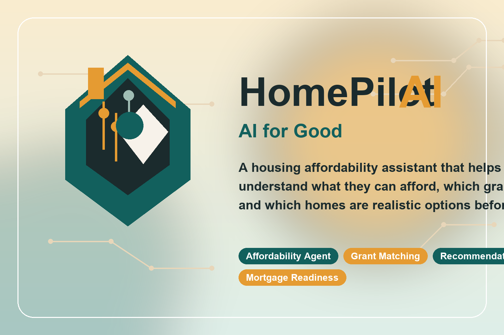

# HomePilot AI

HomePilot AI is a full-stack housing affordability assistant built with Flutter and Spring Boot. It helps users estimate affordable rent and purchase ranges, match with housing assistance programs, explore listings, save favorites, and gauge mortgage readiness.

---

## Screenshots

| Login | Dashboard | Chatbot |
|-------|-----------|---------|
|  |  |  |

| Recommendations | Grant Eligibility | Mortgage Estimate |
|-----------------|-------------------|-------------------|
|  |  |  |

| Listings | Saved Properties | My Profile |
|----------|-----------------|------------|
|  |  |  |

> Screenshots can be added to `assets/screenshots/`. The full slide deck is at [`presentation/HomePilotAI_Hackathon_Deck.pptx`](presentation/HomePilotAI_Hackathon_Deck.pptx).

---

## Branding

| Logo | Thumbnail |
|------|-----------|
|  |  |

---

## Demo Credentials

- Email: `demo@homepilot.ai`
- Password: `HomePilot123!`

These credentials are seeded into the Spring Boot app automatically. If the backend is temporarily unavailable during a demo, the same login also activates an offline fallback mode inside the Flutter app so judges can still browse recommendations, grants, listings, and mortgage estimates.

## AI for Good Challenge Fit

HomePilot AI addresses a real-world problem outside college life: housing affordability and access. Many renters and first-time buyers struggle to understand what they can actually afford, which grants they qualify for, and which homes are realistic options before wasting time on listings that are financially out of reach.

This project uses AI for good by turning messy financial and housing inputs into practical guidance:

- it estimates safe rent and home-buying budgets
- it matches users with grants and housing assistance programs
- it ranks listings by affordability, fit, and likely support eligibility
- it gives users a clearer path toward stable housing decisions

In short, the AI is not being used for convenience alone. It is being used to reduce housing confusion, improve access to support programs, and help people make better, fairer, and more informed housing choices.

## Project Structure

```text
HomePilotAI/
├── README.md
├── backend_springboot/
│   ├── pom.xml
│   ├── mvnw
│   ├── mvnw.cmd
│   ├── src/main/java/com/homepilotai/
│   │   ├── agents/
│   │   │   ├── AffordabilityAgentConnector.java
│   │   │   ├── GrantMatchingAgentConnector.java
│   │   │   ├── MortgageAgentConnector.java
│   │   │   ├── RecommendationAgentConnector.java
│   │   │   └── local/
│   │   │       ├── LocalAffordabilityAgentConnector.java
│   │   │       ├── LocalGrantMatchingAgentConnector.java
│   │   │       ├── LocalMortgageAgentConnector.java
│   │   │       └── LocalRecommendationAgentConnector.java
│   │   ├── config/
│   │   │   ├── DataSeederConfig.java
│   │   │   ├── RestExceptionHandler.java
│   │   │   └── SecurityConfig.java
│   │   ├── controllers/
│   │   │   ├── AiController.java
│   │   │   ├── AuthController.java
│   │   │   ├── DashboardController.java
│   │   │   ├── ListingsController.java
│   │   │   └── ProfileController.java
│   │   ├── dto/
│   │   │   ├── AffordabilityRequest.java
│   │   │   ├── AffordabilityResponse.java
│   │   │   ├── AuthResponse.java
│   │   │   ├── DashboardResponse.java
│   │   │   ├── FavoriteRequest.java
│   │   │   ├── GrantMatchRequest.java
│   │   │   ├── GrantMatchResponse.java
│   │   │   ├── GrantMatchResult.java
│   │   │   ├── ListingResponse.java
│   │   │   ├── LoginRequest.java
│   │   │   ├── MortgageEstimateRequest.java
│   │   │   ├── MortgageEstimateResponse.java
│   │   │   ├── ProfileSetupRequest.java
│   │   │   ├── RecommendationRequest.java
│   │   │   ├── RecommendationResponse.java
│   │   │   ├── RecommendationResult.java
│   │   │   ├── SignupRequest.java
│   │   │   └── UserProfileResponse.java
│   │   ├── models/
│   │   │   ├── AppUser.java
│   │   │   ├── GrantProgram.java
│   │   │   ├── Listing.java
│   │   │   ├── MortgageEstimate.java
│   │   │   ├── Recommendation.java
│   │   │   ├── RentOrBuyPreference.java
│   │   │   └── SavedProperty.java
│   │   ├── repositories/
│   │   │   ├── AppUserRepository.java
│   │   │   ├── GrantProgramRepository.java
│   │   │   ├── ListingRepository.java
│   │   │   ├── MortgageEstimateRepository.java
│   │   │   ├── RecommendationRepository.java
│   │   │   └── SavedPropertyRepository.java
│   │   ├── security/
│   │   │   ├── CustomUserDetailsService.java
│   │   │   ├── JwtAuthenticationFilter.java
│   │   │   └── JwtService.java
│   │   ├── services/
│   │   │   ├── AffordabilityAgentService.java
│   │   │   ├── AuthService.java
│   │   │   ├── DashboardService.java
│   │   │   ├── FinancialProfileSupportService.java
│   │   │   ├── GrantMatchingAgentService.java
│   │   │   ├── ListingService.java
│   │   │   ├── MortgageAgentService.java
│   │   │   ├── RecommendationAgentService.java
│   │   │   ├── SavedPropertyService.java
│   │   │   └── UserProfileService.java
│   │   └── HomePilotApplication.java
│   ├── src/main/resources/
│   │   └── application.properties
│   └── src/test/
│       ├── java/com/homepilotai/
│       │   └── HomePilotApplicationTests.java
│       └── resources/
│           └── application.properties
├── frontend_flutter/
│   ├── pubspec.yaml
│   ├── pubspec.lock
│   ├── lib/
│   │   ├── main.dart
│   │   ├── models/
│   │   │   ├── affordability_model.dart
│   │   │   ├── auth_response.dart
│   │   │   ├── dashboard_model.dart
│   │   │   ├── grant_match_model.dart
│   │   │   ├── listing_model.dart
│   │   │   ├── mortgage_estimate_model.dart
│   │   │   ├── recommendation_model.dart
│   │   │   └── user_profile.dart
│   │   ├── screens/
│   │   │   ├── dashboard_screen.dart
│   │   │   ├── grant_eligibility_screen.dart
│   │   │   ├── home_shell.dart
│   │   │   ├── listings_screen.dart
│   │   │   ├── login_screen.dart
│   │   │   ├── mortgage_estimate_screen.dart
│   │   │   ├── profile_setup_screen.dart
│   │   │   ├── recommendations_screen.dart
│   │   │   ├── saved_properties_screen.dart
│   │   │   └── signup_screen.dart
│   │   ├── services/
│   │   │   ├── ai_service.dart
│   │   │   ├── api_client.dart
│   │   │   ├── app_session.dart
│   │   │   ├── auth_service.dart
│   │   │   ├── listing_service.dart
│   │   │   └── profile_service.dart
│   │   └── widgets/
│   │       ├── app_shell_scaffold.dart
│   │       ├── empty_state.dart
│   │       ├── listing_card.dart
│   │       └── metric_card.dart
│   └── test/
│       └── widget_test.dart
├── agent_connectors/
│   └── README.md
├── database_schema.sql
└── docker-compose.yml
```

### Structure Summary

- `backend_springboot/` contains the Spring Boot API, security, data model, repositories, seeded mock data, and modular AI agent services.
- `backend_springboot/src/main/java/com/homepilotai/agents/` is the connector seam for affordability, grants, recommendations, and mortgage agents.
- `frontend_flutter/` contains the mobile client, including auth flow, dashboard, listings, saved properties, grants, and mortgage screens.
- `agent_connectors/` is the root-level folder reserved for future external AI provider integrations and implementation notes.
- `database_schema.sql` and `docker-compose.yml` make the MVP easy to demo locally.

## MVP Features

- JWT authentication with signup and login
- Post-login profile setup flow
- AI affordability estimator
- Grant eligibility matcher
- Property recommendation ranking
- Mortgage estimate and readiness scoring
- Mock rental and purchase listings
- Saved properties
- Flutter mobile screens wired to backend APIs
- Offline fallback mode for the seeded demo account if the API is unavailable

## Backend Endpoints

- `POST /auth/signup`
- `POST /auth/login`
- `GET /profile`
- `PUT /profile`
- `GET /dashboard`
- `GET /listings`
- `GET /listings/{id}`
- `GET /favorites`
- `POST /favorites`
- `POST /ai/affordability`
- `POST /ai/grants`
- `POST /ai/recommendations`
- `POST /ai/mortgage-estimate`

## Example API Responses

`POST /ai/affordability`

```json
{
  "message": "Based on your income and household size your recommended monthly rent range is $1160-$1502.",
  "recommendedRentMin": 1160,
  "recommendedRentMax": 1502,
  "recommendedPurchaseMin": 173917,
  "recommendedPurchaseMax": 207421,
  "estimatedDebtToIncomeRatio": 0.195,
  "recommendedHousingBudget": 1365
}
```

`POST /ai/grants`

```json
{
  "matches": [
    {
      "programId": 1,
      "programName": "First Step Homebuyer Grant",
      "rationale": "Matches your buy preference. Income appears within the target range. Location fit looks strong.",
      "coverageAmount": 12000,
      "eligibilityScore": 89
    }
  ]
}
```

`POST /ai/recommendations`

```json
{
  "recommendations": [
    {
      "listingId": 8,
      "title": "Columbus Affordable Cottage",
      "price": 156000,
      "location": "Columbus, OH",
      "bedrooms": 2,
      "bathrooms": 1,
      "rentOrBuy": "BUY",
      "score": 86.8,
      "fitSummary": "Fits your working budget. Grant eligibility may improve the overall fit."
    }
  ]
}
```

## Agent Logic Notes

Agent connector folder:
- `agent_connectors/` is the root-level handoff folder for future external agent providers
- `backend_springboot/src/main/java/com/homepilotai/agents/` contains the live Java connector interfaces
- `backend_springboot/src/main/java/com/homepilotai/agents/local/` contains the current local implementations

Affordability agent:
- Converts the user income range into an estimated annual income midpoint
- Uses a conservative `28%` housing budget ratio
- Produces rent range, purchase range, and estimated DTI

Grant matching agent:
- Scores seeded grant programs against `type`, `maxIncome`, `minCredit`, `householdMin`, and `location`
- Returns ranked results with rationale text

Recommendation agent:
- Scores listings using budget compatibility, location fit, household sizing, and grant boost
- Saves generated recommendation scores into the `recommendations` table

Mortgage agent:
- Uses a conservative monthly housing ratio and credit-adjusted borrowing multiplier
- Stores mortgage estimates for the current user

## Demo Reliability and Fallbacks

- Backend default mode uses an embedded H2 database, so the app can run locally even if PostgreSQL is not set up yet.
- PostgreSQL is still supported for fuller deployment by overriding `DB_URL`, `DB_USERNAME`, `DB_PASSWORD`, and optionally `DB_DRIVER`.
- Flutter chooses a platform-aware API base URL automatically:
  - Android emulator: `http://10.0.2.2:8080`
  - iOS simulator, macOS, and local desktop: `http://127.0.0.1:8080`
  - Web: `http://localhost:8080`
- If the backend is unreachable, the seeded demo account falls back to local sample data for dashboard insights, grant matches, recommendations, listings, saved properties, and mortgage estimates.

## First-Time Setup

### Prerequisites

| Tool | Version | Install |
|------|---------|---------|
| Flutter SDK | 3.10+ | https://docs.flutter.dev/get-started/install |
| Java JDK | 17+ | https://adoptium.net |
| Docker Desktop | any | https://www.docker.com/products/docker-desktop (optional — app works without it using embedded H2) |
| Android Studio | any | For Android emulator / SDK |
| Xcode | 15+ | Mac App Store — required for iOS builds |
| Chrome | any | Pre-installed on most systems |

---

### Step 1 — Install Flutter dependencies

```bash
cd HomePilotAI/frontend_flutter
flutter pub get
```

Run this once after cloning. Re-run any time `pubspec.yaml` changes.

---

### Step 2 — Start the backend

```bash
cd HomePilotAI/backend_springboot
./mvnw spring-boot:run
```

The backend starts on `http://localhost:8080`. It uses an embedded H2 database by default — **no Docker or PostgreSQL needed for a demo**. The seeded demo account (`demo@homepilot.ai / HomePilot123!`) is created automatically on first boot.

To use PostgreSQL instead:

```bash
docker compose -f HomePilotAI/docker-compose.yml up -d

export DB_URL=jdbc:postgresql://localhost:5432/homepilotai
export DB_USERNAME=postgres
export DB_PASSWORD=postgres
./mvnw spring-boot:run
```

---

### Step 3 — Run on your target platform

#### Chrome (Web)

```bash
cd HomePilotAI/frontend_flutter
flutter run -d chrome
```

If the Flutter dev server picks a port that isn't in the backend CORS list, pass it explicitly:

```bash
flutter run -d chrome --web-port 3000
```

Or add the port to `CORS_ALLOWED_ORIGINS` before starting the backend:

```bash
export CORS_ALLOWED_ORIGINS="http://localhost:3000,http://localhost:YOUR_PORT"
./mvnw spring-boot:run
```

#### Android (Emulator or physical device)

1. Open Android Studio → **Device Manager** → start an emulator (API 26+), or plug in a physical device with USB debugging enabled.
2. Run:

```bash
cd HomePilotAI/frontend_flutter
flutter run -d android
```

The app automatically points API calls to `http://10.0.2.2:8080` (emulator) or `http://127.0.0.1:8080` (physical device via ADB reverse). For a physical device without ADB reverse, pass your machine's local IP:

```bash
flutter run -d android --dart-define=API_BASE_URL=http://192.168.X.X:8080
```

#### iOS (Simulator or physical device)

> Mac + Xcode 15+ required.

1. Open Xcode, go to **Settings → Platforms** and make sure an iOS simulator is installed.
2. Run:

```bash
cd HomePilotAI/frontend_flutter
flutter run -d ios
```

For a physical iPhone, open `HomePilotAI/frontend_flutter/ios/Runner.xcworkspace` in Xcode, set your Apple Developer team under **Signing & Capabilities**, then run from Xcode or use `flutter run`.

---

### Step 4 — Log in

Use the demo account pre-seeded by the backend:

| Field | Value |
|-------|-------|
| Email | `demo@homepilot.ai` |
| Password | `HomePilot123!` |

If the backend is not running, these credentials also activate **offline demo mode** inside the Flutter app — all screens load with local sample data.

---

### Troubleshooting

| Symptom | Fix |
|---------|-----|
| `flutter: Could not reach backend` | Make sure Step 2 completed and the backend is running on port 8080 |
| CORS error in Chrome DevTools | Add the Flutter dev port to `CORS_ALLOWED_ORIGINS` (see Step 3) |
| Android: `cleartext traffic not permitted` | Already fixed in `AndroidManifest.xml` — rebuild with `flutter run` |
| iOS: ATS error for localhost | Already fixed in `Info.plist` — clean build with `flutter clean && flutter run` |
| `flutter pub get` fails | Make sure Flutter SDK is on PATH: `flutter --version` |
| Backend port 8080 in use | `export SERVER_PORT=8081` then update API URL: `flutter run --dart-define=API_BASE_URL=http://localhost:8081` |

---

## Run Locally

### 1. Start PostgreSQL

```bash
cd HomePilotAI
docker compose up -d
```

### 2. Run Spring Boot

```bash
cd HomePilotAI/backend_springboot
./mvnw spring-boot:run
```

Optional environment variables:

```bash
export DB_URL=jdbc:postgresql://localhost:5432/homepilotai
export DB_USERNAME=postgres
export DB_PASSWORD=postgres
export JWT_SECRET=homepilotai-super-secret-key-homepilotai-super-secret-key
```

### 3. Run Flutter

Android emulator:

```bash
cd HomePilotAI/frontend_flutter
flutter run
```

If you need a different backend host:

```bash
flutter run --dart-define=API_BASE_URL=http://localhost:8080
```

## Verification

- Backend: `./mvnw test`
- Flutter: `flutter analyze`
- Flutter tests: `flutter test`

## Revenue Model

HomePilot AI monetizes through a B2B2C model: landlords and real estate agents pay to list properties directly to pre-qualified buyers and renters surfaced by the AI.

### Landlord & Agent Subscription Tiers

| Tier | Price | Listings | Extras |
|------|-------|----------|--------|
| Free Trial | $0 | 1 active listing · 30 days | — |
| Basic | $29 / month | Up to 5 listings | Standard placement |
| Premium | $79 / month | Unlimited listings | Featured placement, priority ranking in recommendations |

### How it works

1. A landlord or agent taps **"List your property"** on the login screen and creates an account, choosing their subscription tier.
2. After signup they get a JWT and can call the **landlord API** (`POST /landlord/listings`, `PUT`, `DELETE`) to manage their listings.
3. Their listings appear in the main search results alongside platform-seeded inventory and are ranked by the AI recommendation engine.
4. Tenants and buyers see property photos, descriptions, and budget-fit scores — landlords get direct exposure to the most financially qualified users for their listing.

### Demo landlord account

| Field | Value |
|-------|-------|
| Email | `landlord@homepilot.ai` |
| Password | `Landlord123!` |
| Business | Peach State Properties |
| Tier | Basic |

### Landlord API endpoints

- `POST /auth/signup/landlord` — create landlord or agent account
- `GET /landlord/listings` — fetch the authenticated landlord's listings
- `POST /landlord/listings` — create a new listing
- `PUT /landlord/listings/{id}` — update a listing
- `DELETE /landlord/listings/{id}` — remove a listing

---

## Future Upgrade Paths

The backend service layer is separated so future integrations can slot in without major restructuring:

- Google Maps API for commute and neighborhood overlays
- Plaid API for verified cashflow analysis
- Zillow or Realtor APIs for live listings
- Vertex AI or Gemini for richer recommendation and underwriting logic
